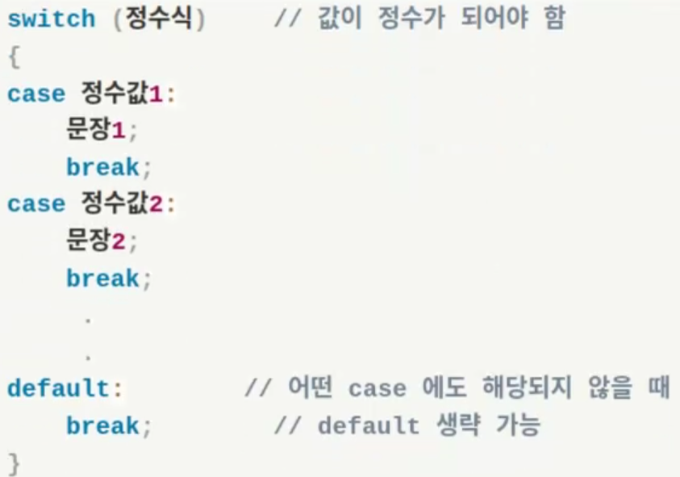

https://www.st.com/content/st_com/en.html


STM32 CubeIDE
STM32 CubeMX
STM32 CubeProgrammer
설치

오버플로우

```c
int main() {
    unsigned char a;
    a = 255;
    printf("%d\n", a);

    a += 1;
    printf("%d\n", a); // 오버플로우
}
```

비트마스크
아래의 예제를 보면 0x5678에서 5,6,7,8을 각각 꺼내기위해 사용한 모습을 볼 수있다.
data를 모르는 값이라고 가정하고 사용한다면 사용하는 의미를 알 수 있다.
예를들어 데이터값이 자주 변한다면 AND연산자를 통해 어느값을 가지고있는지 알고 꺼내쓸수있고
OR연산자를 통해 데이터의 필요한부분을 1 변경할수있다.
만약 1을 0으로 바꾸고싶다면 반전(NOT) ~ 을 사용할수있다.
AND 연산을 걸면 원하는 위치의 값을 뽑아낼수있고

```c
int main() {
    unsigned short data = 0x5678;   // 0101 0110 0111 1000

    unsigned short msk1 = 0xf000;   // 1111 0000 0000 0000
    unsigned short msk2 = 0x0f00;   // 0000 1111 0000 0000
    unsigned short msk3 = 0x00f0;   // 0000 0000 1111 0000
    unsigned short msk4 = 0x000f;   // 0000 0000 0000 1111
    
    printf(" 결과값 1 = %#.4x \n", data & msk1);    // 결과값 1 = 0x5000 
    printf(" 결과값 2 = %#.4x \n", data & msk2);    // 결과값 2 = 0x0600 
    printf(" 결과값 3 = %#.4x \n", data & msk3);    // 결과값 3 = 0x0070 
    printf(" 결과값 4 = %#.4x \n", data & msk4);    // 결과값 4 = 0x0008 
}
```

OR 연산을 걸면 원하는 위치에 값을 집어넣을수있다.

```c
int main() {
    unsigned short data = 0x0000;   // 0000 0000 0000 0000

    unsigned short msk1 = 0xf000;   // 1111 0000 0000 0000
    unsigned short msk2 = 0x0f00;   // 0000 1111 0000 0000
    unsigned short msk3 = 0x00f0;   // 0000 0000 1111 0000
    unsigned short msk4 = 0x000f;   // 0000 0000 0000 1111
    
    printf(" 결과값 1 = %#.4x \n", data | msk1);    // 결과값 1 = 0xf000  
    printf(" 결과값 2 = %#.4x \n", data | msk2);    // 결과값 2 = 0x0f00  
    printf(" 결과값 3 = %#.4x \n", data | msk3);    // 결과값 3 = 0x00f0  
    printf(" 결과값 4 = %#.4x \n", data | msk4);    // 결과값 4 = 0x000f  
}
```


원하는 비트를 1로 바꾸고 싶다면, `1 << 위치`를 사용해 마스크를 만들고, `OR` 연산을 적용하면 됩니다.  
반대로 0으로 바꾸고 싶다면, `~(1 << 위치)`로 마스크를 만든 뒤, `AND` 연산을 적용하면 됩니다.

묵시적 형변환

```c
// 묵시적 형변환
int main() {
    int a,b,c;
    double average;
    printf("정수 3개를 입력하세요 : ");
    scanf("%d %d %d", &a, &b, &c);

//     average = (a + b + c) / 3;
//     printf("평균은 : %f\n", average); // 2,2,3을 넣었다고 가정하고했을때 2.333333이 나와야하지만 2.000000 이 출력된다.

    average = (double)(a + b + c) / 3; // 형변환
    printf("평균은 : %f\n", average); // 2.333333
}
```

switch case문



```c
int main() {
    int num;
    printf("미세먼지 농도를 선택하시오\n");
    printf("1 : 좋음\n");
    printf("2 : 보통\n");
    printf("3 : 나쁨\n");
    scanf("%d", &num);

    switch (num) // 정수여야함
    {
    case 1:
        printf("미세먼지 농도가 좋으니까 마스크 안써도됨\n");
        break;
    case 2:
        printf("미세먼지 농도가 보통이니까 마스크 써도되고 안써도됨\n");
        break;
    case 3:
        printf("미세먼지 농도가 나쁘니까 마스크 쓰는걸 권장\n");
        break;
    default:
        printf("1,2,3 중에 선택해주세요.");
        break;
    }
}
```

반복문 while

```c
int main() {
    int weight = 80;
    int count = 0;

    while(weight > 60) {
        printf("매일 운동해서 1kg을 뺀다.\n");
        weight--;
        count++;
    }
    printf("축하합니다. 운동 안해도됨\n");
    printf("%d 일 운동 했음\n\n", count);
}```

반복문 for

```c
int main() {
    int weight;
    int count = 0;

    // weight--를 for 조건문에 넣고 count++을 for문 안에 넣어도됨
    for(weight = 80; weight > 60; count++) {
        printf("운동 했음\n");
        weight--;
    }

    printf("축하합니다. 운동 안해도됨\n");
    printf("%d 일 운동 했음\n\n", count);
}
```

다중 반복문

```c
int main() {
    int i,j;

    for(i = 0; i < 3; i++) {
        printf("외부 for문 시작 %d\n", i);
        for(j = 0; j < 3; j++) {
            printf("내부 for문 시작 %d\n", j);
        }
        printf("내부 for문 끝\n");
    }
}

int main() {
    int i,j;
    for(i = 0; i < 5; i++) {
        for(j = 0; j <= i; j++) {
            printf("*");
        }
        printf("\n");
    }
    for(i = 4; i > 0; i--) {
        for(j = 0; j < i; j++) {
            printf("*");
        }
        printf("\n");
    }
}

*
**
***
****
*****
****
***
**
*
```

함수
프로그래밍에서 함수란 특별한 목적의 작업을 수행하기 위한 독립적으로 설계된 프로그램 코드의 집합
표준함수 / 사용자정의 함수

```c
int printHello() {
    printf("Hello World\n");
    return 0;
}

int main() {
    printHello();
}
```

```c
int printHello(); // 함수의 원형 ( 해당 소스파일중 어딘가 printHello라는 함수가 있다고 컴파일러에게 알림 )

int main() {
    printHello();
}

int printHello() {
    printf("Hello World\n");
    return 0;
}
```

```c
int add(int a, int b);

int main() {
    int x, y, z;
    printf("정수 2개를 입력하세요 : ");
    scanf("%d %d", &x, &y);

    z = add(x, y);
    printf("%d\n", z);
}

int add(int a, int b) {
    int sum;
    sum = a + b;
    return sum;
}
```

### 변수의 유효범위
지역변수

```c
// {} 중괄호 내에서 선언된 변수
// 중괄호 내에서만 유효, 중괄호가 종료되면 메모리에서 사라짐
// 메모리영역내의 stack(스택)영역에 저장, 초기화하지 않으면 쓰레기값
// 함수의 매개변수도 함수내에서는 지역변수로 취급
// 프로그램이 실행될때 메모리공간 확보
void local(void);

int main() {
    int i = 5;      // local variable
    int var = 10;   // local variable

    printf("main()함수내의 지역변수 var의 값 : %d\n", var);

    if(i < 10) {
        local();        // 함수 호출
        int var = 30;   // if문 내의 local variable
        printf("if문 내에서의 var의 값 : %d\n", var);
    }

    printf("현재 지역변수 var의 값 : %d\n", var);
}

void local(void) {
    int var = 20;       // local()내의 local variable
    printf("local() 함수 내에서의 지역변수 : %d\n", var);
}
```

정적변수
정적변수는 메모리의 한공간을 먼저 차지하고 실행되기때문에 프로그램이 종료되기 전까지 값이 유지된다 반면 지역변수는 호출할때마다 새로운공간을 할당받아 선언되기때문에 유지가되지않는다.

```c
// 정적변수
// static(키워드)로 정의된 변수 ex) static int a;
// 전역변수와 지역변수의 특징을 모두 가지고있다.
// 함수내에서 선언된 정적변수는 단 한번만 초기화 가능
// 프로그램이 종료되어야 메모리에서 삭제됨
// 위에처럼 선언된 정적변수는 지역변수처럼 해당 함수(블록)에서만 접근 가능
// 전역변수처럼 초기화하지 않으면 0으로 초기화됨

void local();
void staticVar();

int main() {
    for(int i = 0; i < 3; i++) {
        local();
        staticVar();
    }
}

void local(){
    int count = 1;
    printf("local() 함수가 %d 번째 호출됨\n", count);
    count++;
};
void staticVar(){
    static int staticCount = 1;
    printf("staticVar() 함수가 %d 번째 호출됨\n", staticCount);
    staticCount++;
};

//local() 함수가 1 번째 호출됨
//staticVar() 함수가 1 번째 호출됨
//local() 함수가 1 번째 호출됨
//staticVar() 함수가 2 번째 호출됨
//local() 함수가 1 번째 호출됨
//staticVar() 함수가 3 번째 호출됨
```

전역변수

```c
void local();   // 함수의 원형 선언
int var;        // var이라는 전역변수 선언

int main() {
    printf("전역변수 var값 : %d\n", var);
    int var = 10;   // 지역변수
    printf("main() 내에서의 지역변수 var 값 : %d\n", var);

    if(1) {
        local();
        printf("현재 변수 var의 값 : %d\n", var);
    }
    printf("더이상 main()함수에서는 전역변수 var이 접근 불가\n");
}

void local(){
    var = 20;
    printf("Local()함수내에서 접근한 var 값은 : %d\n", var);
}
```

배열

```c
/*
    배열
    같은 데이터타입의 변수들로 이루어진 유한집합
    배열을 구성하는 각각의 값 -> 배열요소(element)
    요소의 위치를 가르키는 것 -> 인덱스(index)
    인덱스의 값은 언제나 0부터 시작, 양의정수값만 가질수 있다.
    배열의 모든 요소는 항상 연속된 메모리에 저장된다.

    예: int num[0]; 이것은 불가능하다.
    예: int size = 100;
        int data[size]; 이것도 불가능하다.

        #define MAX 5
        int data[MAX];  이것은 가능하다
*/

int main() {
    int arr[5];      // 4바이트인 int타입의 배열 5칸 선언
    int byteArr = 0; // 배열의 바이트 크기를 저장할 변수 선언
    int size = 0;    // 배열의 크기를 지정할 변수

    byteArr = sizeof(arr);
    printf("배열의 바이트 크기 : %d\n", byteArr);

    size = sizeof(arr) / sizeof(arr[0]); //배열의 바이트 크기 : 20
    printf("배열의 크기 : %d\n", size);    //배열의 크기 : 5

    // 배열의 각 요소를 0으로 초기화
    for(int i = 0; i < size; i++) {
        arr[i] = 0;
    }
    
    for(int i = 0; i < size; i++) {
        printf("arr[%d] : %d\n", i, arr[i]);
    }
}
```
