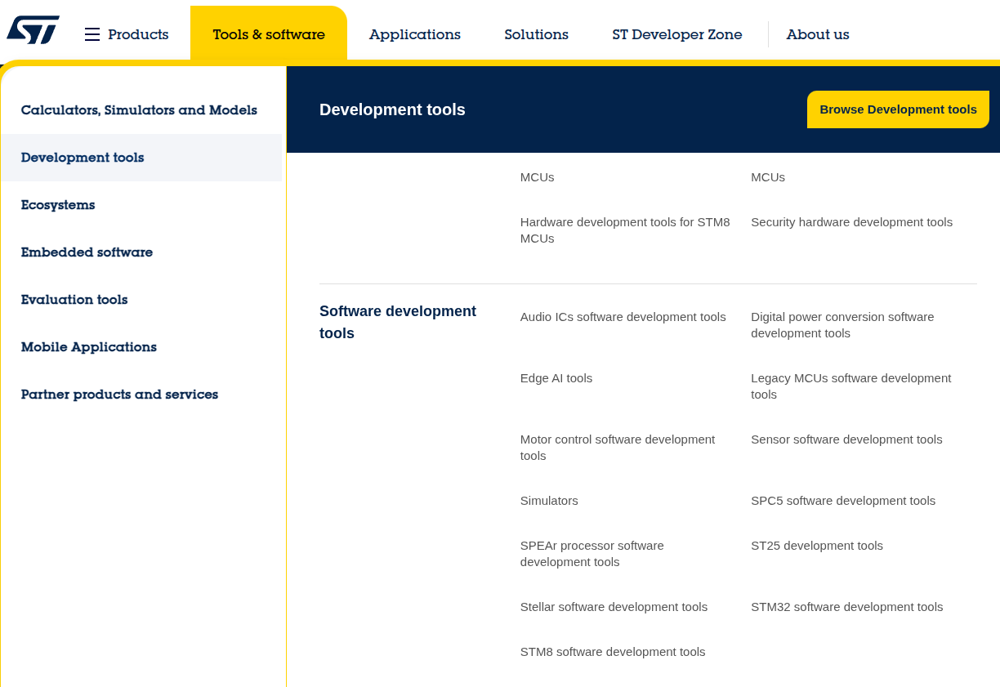
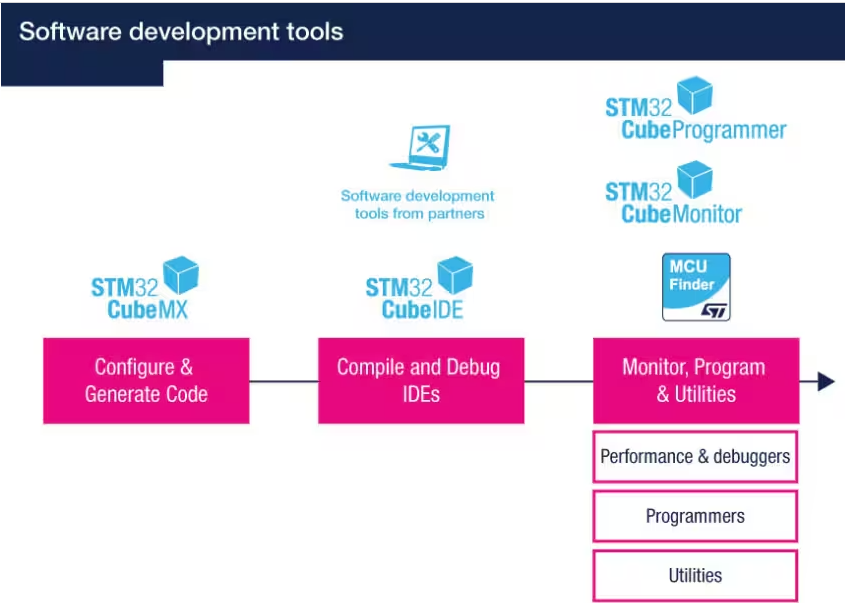
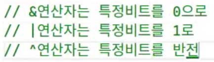

https://www.st.com/content/st_com/en.html






STM32 CubeIDE
STM32 CubeMX

오버플로우

```c
int main() {
    unsigned char a;
    a = 255;
    printf("%d\n", a);

    a += 1;
    printf("%d\n", a); // 오버플로우
}
```

비트마스크
아래의 예제를 보면 0x5678에서 5,6,7,8을 각각 꺼내기위해 사용한 모습을 볼 수있다.
data를 모르는 값이라고 가정하고 사용한다면 사용하는 의미를 알 수 있다.
예를들어 데이터값이 자주 변한다면 AND연산자를 통해 어느값을 가지고있는지 알고 꺼내쓸수있고
OR연산자를 통해 데이터의 필요한부분을 1 변경할수있다.
만약 1을 0으로 바꾸고싶다면 반전(NOT) ~ 을 사용할수있다.
AND 연산을 걸면 원하는 위치의 값을 뽑아낼수있고

```c
int main() {
    unsigned short data = 0x5678;   // 0101 0110 0111 1000

    unsigned short msk1 = 0xf000;   // 1111 0000 0000 0000
    unsigned short msk2 = 0x0f00;   // 0000 1111 0000 0000
    unsigned short msk3 = 0x00f0;   // 0000 0000 1111 0000
    unsigned short msk4 = 0x000f;   // 0000 0000 0000 1111
    
    printf(" 결과값 1 = %#.4x \n", data & msk1);    // 결과값 1 = 0x5000 
    printf(" 결과값 2 = %#.4x \n", data & msk2);    // 결과값 2 = 0x0600 
    printf(" 결과값 3 = %#.4x \n", data & msk3);    // 결과값 3 = 0x0070 
    printf(" 결과값 4 = %#.4x \n", data & msk4);    // 결과값 4 = 0x0008 
}
```

OR 연산을 걸면 원하는 위치에 값을 집어넣을수있다.

```c
int main() {
    unsigned short data = 0x0000;   // 0000 0000 0000 0000

    unsigned short msk1 = 0xf000;   // 1111 0000 0000 0000
    unsigned short msk2 = 0x0f00;   // 0000 1111 0000 0000
    unsigned short msk3 = 0x00f0;   // 0000 0000 1111 0000
    unsigned short msk4 = 0x000f;   // 0000 0000 0000 1111
    
    printf(" 결과값 1 = %#.4x \n", data | msk1);    // 결과값 1 = 0xf000  
    printf(" 결과값 2 = %#.4x \n", data | msk2);    // 결과값 2 = 0x0f00  
    printf(" 결과값 3 = %#.4x \n", data | msk3);    // 결과값 3 = 0x00f0  
    printf(" 결과값 4 = %#.4x \n", data | msk4);    // 결과값 4 = 0x000f  
}
```



원하는 비트를 1로 바꾸고 싶다면, `1 << 위치`를 사용해 마스크를 만들고, `OR` 연산을 적용하면 됩니다.  
반대로 0으로 바꾸고 싶다면, `~(1 << 위치)`로 마스크를 만든 뒤, `AND` 연산을 적용하면 됩니다.

묵시적 형변환

```c
// 묵시적 형변환
int main() {
    int a,b,c;
    double average;
    printf("정수 3개를 입력하세요 : ");
    scanf("%d %d %d", &a, &b, &c);

//     average = (a + b + c) / 3;
//     printf("평균은 : %f\n", average); // 2,2,3을 넣었다고 가정하고했을때 2.333333이 나와야하지만 2.000000 이 출력된다.

    average = (double)(a + b + c) / 3; // 형변환
    printf("평균은 : %f\n", average); // 2.333333
}
```
